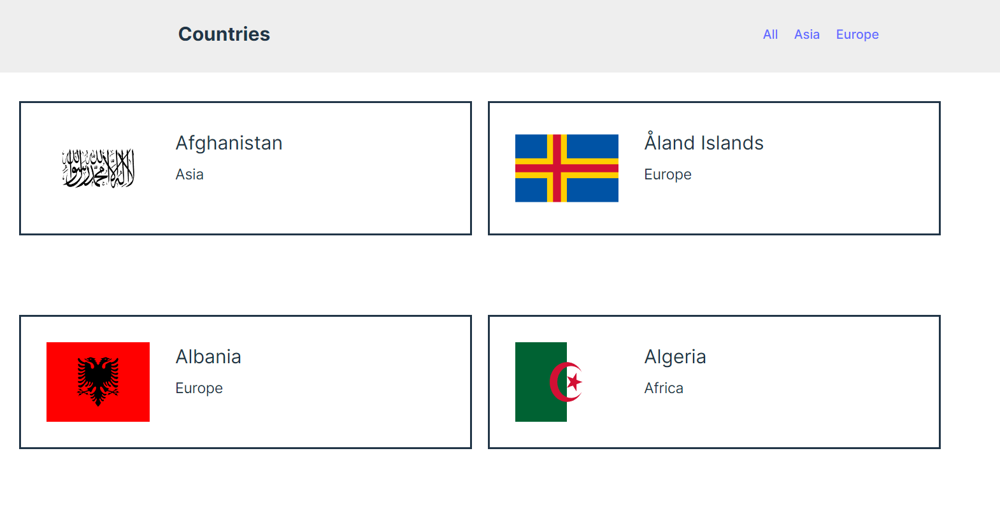

# Installation

1. Clone the repository to local machine.

```bash
git clone https://github.com/jisshub/Countries-React-App-Timesword-test.git
```

2. Change directory to app directory.

```bash
cd .\Countries-React-App-Timesword-test\
```

3. Checkout branch to `master` branch to view the app directories and files.

```bash
git branch -a
git checkout remotes/origin/master
```

4. Run `npm install` on your terminal.

5. Run `npm run dev` to start the development server.

App deployed to https://elegant-kheer-25b3e7.netlify.app/


### Screenshot

